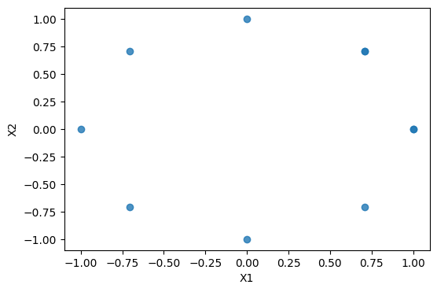
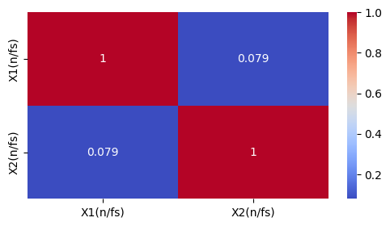
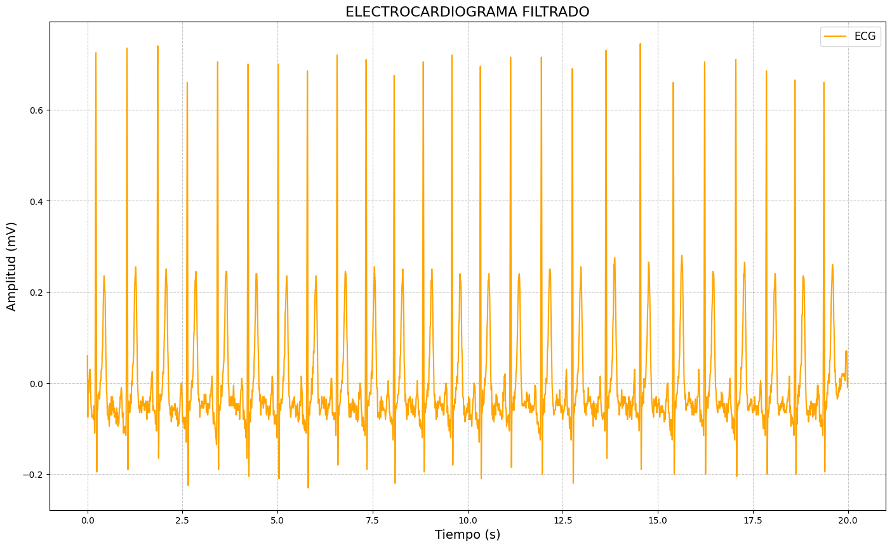
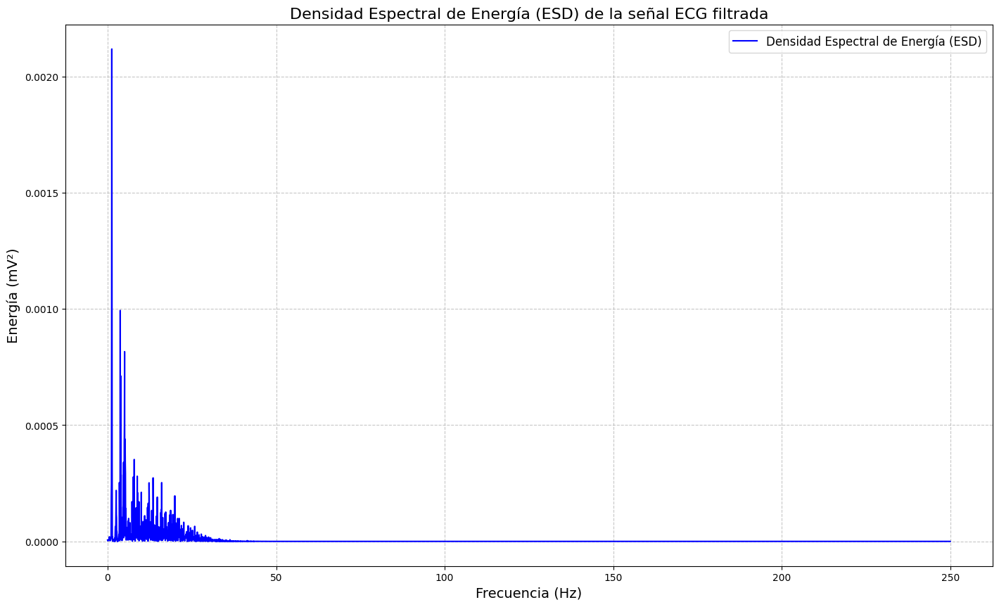
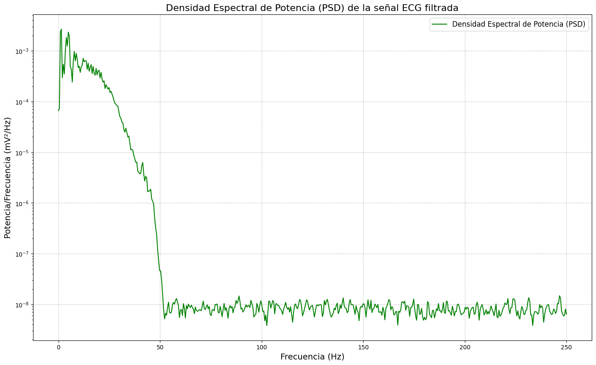
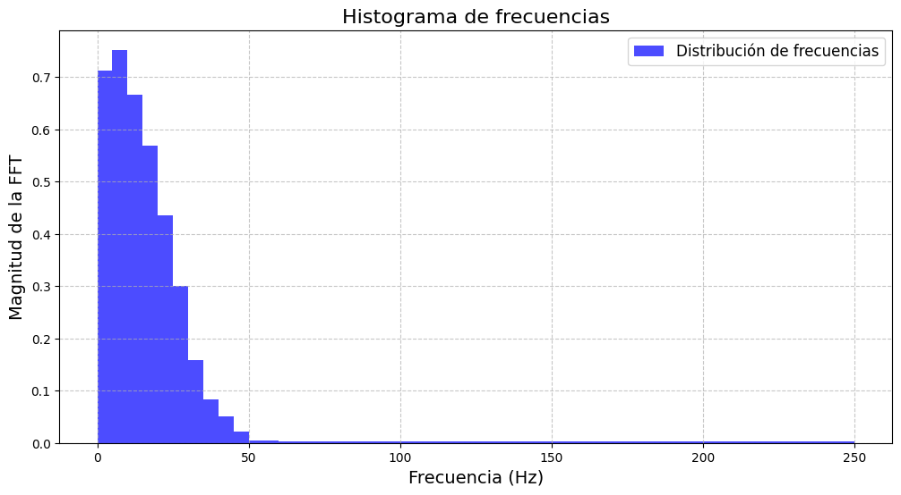

# Convolución correlación y transformación
## Descripción
En el presente desarollo de laboratorio se tiene encuenta las siguientes operaciones y herramientas:
+ Convolución.
+ Correlación.
+ Transformada de Fourie.
  
Las cuales son fundamentales para operar entre señal y sistema, entre señales y para facilitar el analisis en el dominio de la freceuncia.
## Tener en cuenta
1. Se descarga una señal fisiologíca EEG de una sola derivación.
2. Se utilizan las siguientes librerias:
   + Wfdb.
   + Numpy.
   + Pandas.
   + Matplotlib.
3. Se utiliza **Jupyter NoteBook** para dividir el código en partes y trabajar en ellas sin importar el orden: escribir, probar funciones, cargar un archivo en la memoria y procesar el contenido. Con lenguaje de **Python**.
## Procedimiento
### Parte A.
Cada integrante debe crear un **sistema** apartir del código estudiantil y una **señal** con cada dígito de la Cédula de Ciudadania para aplicar la operación **CONVOLUCIÓN**; se realiza la gráfica secuencial, a mano y en lenguaje de **Python**.
#### *Integrante 1* 

<br><em>Figura 1: Convolución 1 entre el sistema **h(n)** y la señal **X[n]** con su respectiva gráfica a mano .</em></p>

>Para programar en lenguaje de Python se utiliza la función de la libreria de Numpy que es **np.convolve([x(n),h(n)])** no importa el orden al poner los vectores dentro de la función porque la convolución es conmutativa. 
>
```python
xa=np.convolve([1, 0, 0, 0, 1, 8, 4, 1, 0, 5], [5, 6, 0, 0, 6, 5, 5])#Ana
print(xa)
>
y(n)= [ 5  6  0  0 11 51 73 29 12 78 99 66 25 35 25 25]
>

# Graficar la señal discreta 
plt.stem(range(len(xa)), xa, linefmt='g', markerfmt='go', basefmt='k')
plt.xlabel("muestras (n)")
plt.ylabel("Y(n)")
plt.title("Convolución Discreta, Ana")
plt.grid(True)
plt.show()
```

<br><em>Figura 2: Gráfica Convolución Discreta **y(n)** vs **n**, integrante 1.</em></p>

#### *Integrante 2* 


<br><em>Figura 3: Convolución 2 entre el sistema **h(n)** y la señal **X[n]** con su respectiva gráfica a mano .</em></p>
```python
xl=np.convolve([1, 0, 5, 4, 2, 8, 2, 8, 5, 8], [5, 6, 0, 0, 6, 6, 2])#Lunay
print(xl)
```
>y(n)=[  5   6  25  50  40  58  90 106 119 138 112  76  82  94  58  16]
>
```python
# Graficar la señal discreta 
plt.stem(range(len(xl)), xl, linefmt='r', markerfmt='ro', basefmt='k')
plt.xlabel("muestras (n)")
plt.ylabel("Y(n)")
plt.title("Convolución Discreta, Luna")
plt.grid(True)
plt.show()
```

<br><em>Figura 4: Gráfica Convolución Discreta **y(n)** vs **n**, integrante 2.</em></p>

#### *Integrante 3* 

<br><em>Figura 5: Convolución 3 entre el sistema **h(n)** y la señal **X[n]** con su respectiva gráfica a mano .</em></p>

```python
xi=np.convolve([1, 0, 1, 1, 0, 8, 3, 9, 5, 4], [5, 6, 0, 0, 6, 6, 7])#Isa
print(xi)
```
>y(n)= [  5   6   5  11  12  46  76  75  92 105  90 128 105 117  59  28]
>
```python
# Graficar la señal discreta 
plt.stem(range(len(xi)), xi)
plt.xlabel("muestras (n)")
plt.ylabel("Y(n)")
plt.title("Convolución Discreta, Isabela")
plt.grid(True)
plt.show()
```

<br><em>Figura 6: Gráfica Convolución Discreta **y(n)** vs **n**, integrante 3.</em></p>

### Parte B.
Se debe encontrar la correlación entre $X_1[nT_s] = \cos(2\pi 100 n T_s)$ y $X_2[nT_s] = \sin(2\pi 100 n T_s)$. Luego se debe encontrar la representación gráfica y secuencial.

Primero se almacena los valores en un DataFrame de la siguiente forma:
```python
fs=1/1.25e-3 # se define la frecuencia de muestreo
n=np.arange(0,10) # almacena valores entre 0 y 9
t= n/fs #conversión a tiempo real (t) donde se divide a n por la frecuencia de muestreo

x1=np.cos((2* np.pi*100*t))
x2=np.sin((2* np.pi*100*t))

df1=pd.DataFrame({
    'X1(n/fs)':x1,
    'X2(n/fs)':x2,
})
df1.head (10)
```
Se obtiene la siguiente tabla donde se tomaron valores de 0 a 9 para *n* debido al rango estipulado inicialmente para cada función.

|     | X1 (n/fs)| X2 (n/fs)|
|:-------:|:-----------------:|:----------:|
|    0    |      1.000000e+00  |   0.000000e+00   |        
|    1    | 7.071068e-01      |     7.071068e-01   |        
|      2  |     6.123234e-17	   |   1.000000e+00     |        
|     3   |      -7.071068e-01	   |     7.071068e-01   |        
|      4  |  -1.000000e+00      |      1.224647e-16  |         
|       5 |  -7.071068e-01       |   -7.071068e-01     |        
|        6|     -1.836970e-16	   |   -1.000000e+00     |        
|       7 |   7.071068e-01      |  -7.071068e-01      |        
|       8 |   1.000000e+00	     |   -2.449294e-16     |       
|       9|  7.071068e-01      |      7.071068e-01  |         

Apartir de esta tabla, se grafica las funciones de la siguiente forma: 

```python
fig, ax = plt.subplots(1, 1, figsize=(6,4)) # se crea la figura y los ejes
ax.scatter(x=df1['X1(n/fs)'], y=df1['X2(n/fs)'], alpha= 0.8) # genera un grafico de dispersion con los datos de df1
ax.set_xlabel('X1') 
ax.set_ylabel('X2');
```
Dando como resultado lo siguiente: 


<br><em>Figura 6: Gráfica de dispersión de **x1** vs **x2** </em></p>

A continuación se calcula la correlación entre las señales **x1** y **x2** de la siguiente forma:
```python
#pearson
correlacion=df1.corr()
correlacion
```
Obteniendo como resultado:
|     | X1 (n/fs)| X2 (n/fs)|
|:-------:|:-----------------:|:----------:|
|    X1 (n/fs)  |     1.000000  |   0.078783  |        
|    X2 (n/fs) |0.078783     |     1.000000  |   


Para tener una mejor visualización sobre los resultados de la correlación, se hizo el siguiente diagrama:

  ```python
# Crear el heatmap
plt.figure(figsize=(6, 3))
sns.heatmap(correlacion, annot=True, cmap="coolwarm")

# Mostrar gráfico
plt.show()
```

<br><em>Figura 7: Heatmap que permite observar la correlación entre **x1** y **x2** </em></p>

Este diagrama nos permite visualizar con mayor facilidad la relación entre **x1 y x2**, por lo que se puede observar que **X1(n/fs)** con **X1(n/fs)** es igual a *1*  lo que quiere decir que cada variable tiene correlación perfecta consigo misma. Esto también pasa en la correlación **X2(n/fs)** con **X2(n/fs)**. En cuanto a **X1(n/fs)** con **X2(n/fs)** se obtiene un resultado de *0.079* lo que muestra que la correlación es muy mínima, casi nula, esto tiene sentido debido a que **cos(x)** y **sin(x)** estan desfasados y no siguen una relación lineal clara.

### Parte C.


<br><em>Figura 8: Electrocardiograma </em></p>



<br><em>Figura 9: Densidad Espectral de Energia </em></p>


<br><em>Figura 10: Densidad Espectral de Potencia </em></p>


<br><em>Figura 11: Histograma de Frecuencia </em></p>


